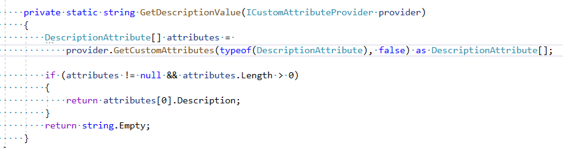

<!--Category:C#--> 
 <p align="right">
    <a href="https://www.nuget.org/packages/ProductivityTools.DescriptionValue/"></a>
    <a href="http://productivitytools.tech/description-attribute-value/"><a> 
    <a href="https://www.github.com/pwujczyk/ProductivityTools.DescriptionValue"></a>
</p>
<p align="center">
    <a href="http://productivitytools.tech/">
        
    </a>
</p>


# Description attribute value

Library allows to get description content from DescriptionAttribute.
<!--more-->

Currently it retrieve value from following elements:

- Property

- Field 

- Method

- Enum


Usage example:
```c#
typeof(TestClass).GetPropertyDescription("PropertyName"); 
typeof(TestClass).GetFieldDescription("FieldName"); 
typeof(TestClass).GetMethodDescription("Method1"); 
testClass.Enum.GetDescription();
```

